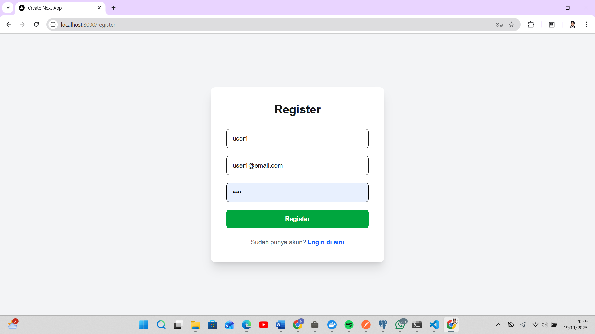
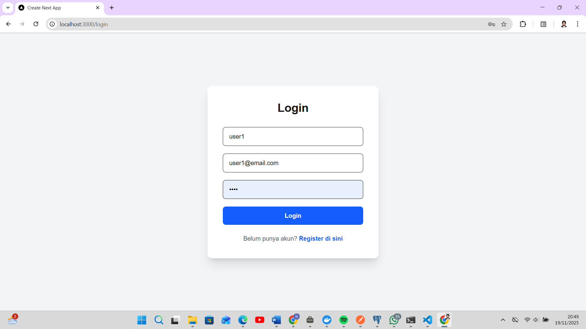
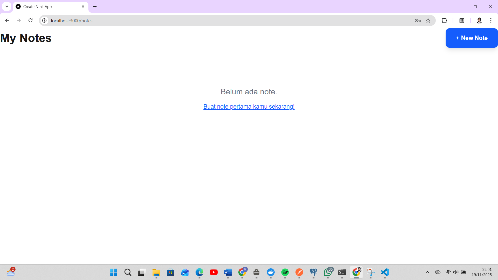
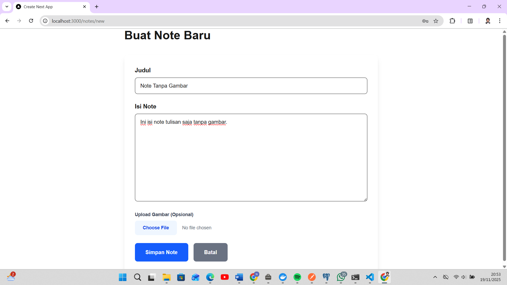
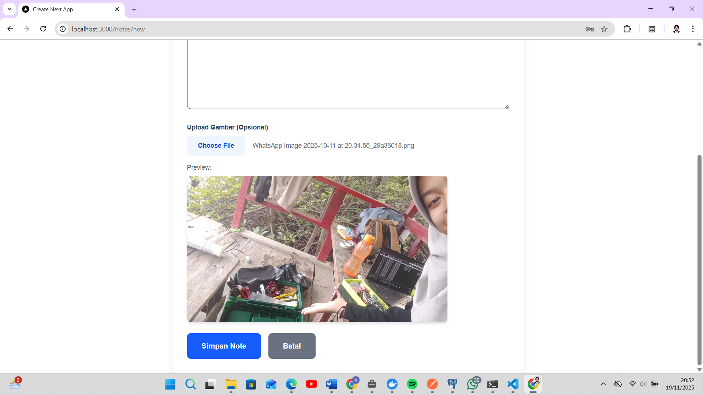
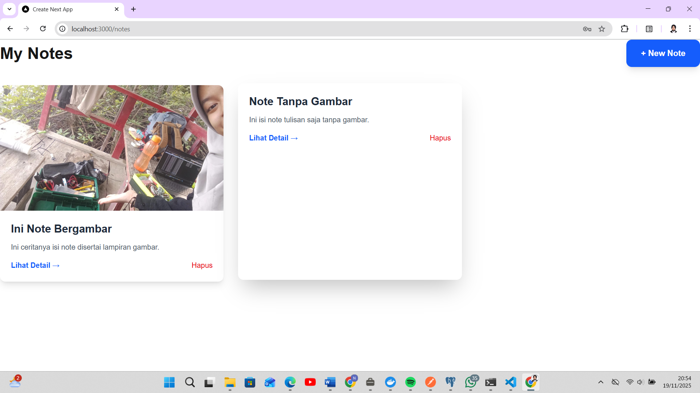
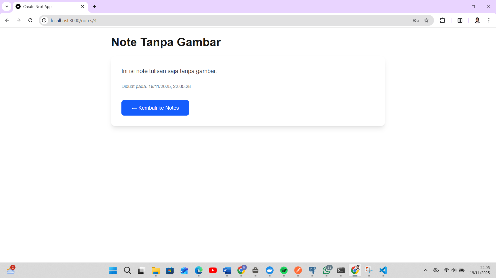
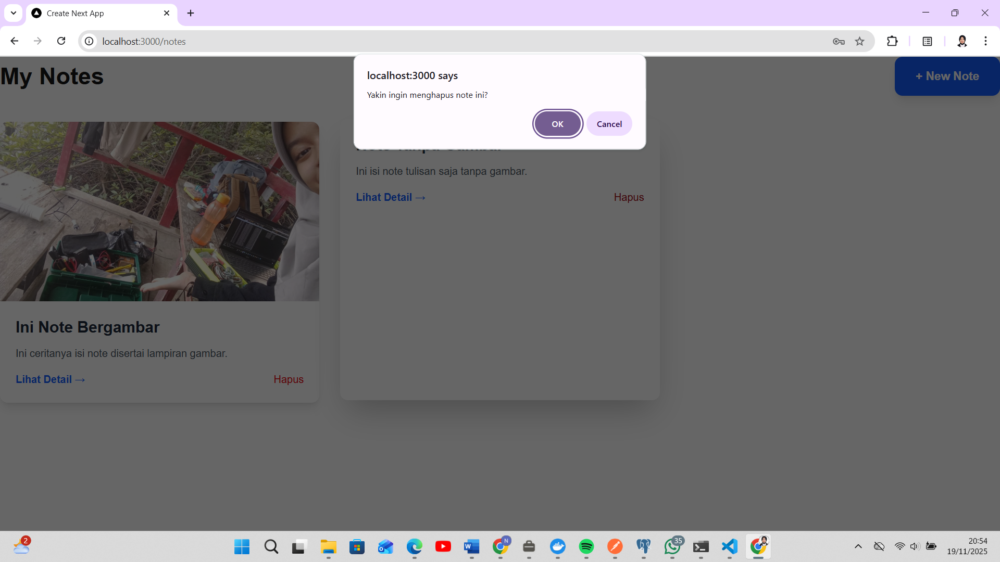

# Notes Sharing App

Aplikasi berbagi notes dengan autentikasi JWT, CRUD notes, upload gambar, dan logging request/response ke DB. Stack: Next.js 16 (Frontend), Golang Fiber v2 (Backend), PostgreSQL 16 (DB), Docker Compose.

## Fitur
- Register & Login dengan JWT Authentication.
- CRUD Notes: Create/Read/List/Delete.
- Upload gambar pada notes (simpan ke /uploads).
- Logging: Setiap request/response dicatat ke table `logs` di DB (datetime, method/endpoint, masked headers, payload, response, status).
- Deployment: Docker Compose dengan persistent DB + uploads.

## Tech Stack & Arsitektur
- Frontend: Next.js.
- Backend: Golang.
- DB: PostgreSQL dengan docker, tables: users, notes, logs.
- Deployment: Docker).
- tambahan: JWT Authentication.
  
## Setup

### Local
#### Backend
1. `cd backend && go mod tidy`
2. Jalankan Postgre local (misal Docker: `docker run -p 5432:5432 -e POSTGRES_PASSWORD=rahasia123 -e POSTGRES_DB=notesdb postgres:16`).
3. `cp .env.example .env` → isi vars.
4. `go run main.go` (port 8000).

#### Frontend
1. `cd notes-frontend && npm install`
2. `cp .env.example .env.local` → isi `NEXT_PUBLIC_API_URL=http://localhost:8000`.
3. `npm run dev` (port 3000).

### Docker
1. `cp .env.example .env` → isi vars.
2. `mkdir uploads` (folder gambar).
3. `docker-compose up --build`.
4. Akses: http://localhost:3000.

## Contoh Log (Query DB)
      timestamp      | method | endpoint  | status_code
---------------------+--------+-----------+-------------
 2025-11-19 13:54:30 | GET    | /notes    |         200
 2025-11-19 13:54:29 | GETION | /notes/2  |         200
 2025-11-19 13:53:58 | GET    | /notes    |         200
 2025-11-19 13:53:58 | POST   | /notes    |         201
 2025-11-19 13:53:10 | GET    | /notes    |         200
 2025-11-19 13:52:49 | GET    | /notes/1  |         200
 2025-11-19 13:52:33 | GET    | /notes    |         200
 2025-11-19 13:49:53 | GET    | /notes    |         200
 2025-11-19 13:49:52 | POST   | /login    |         200
 2025-11-19 13:49:05 | POST   | /register |         201
(10 rows)

## Screenshots
  
 
  
  
  
  
  
 
  
